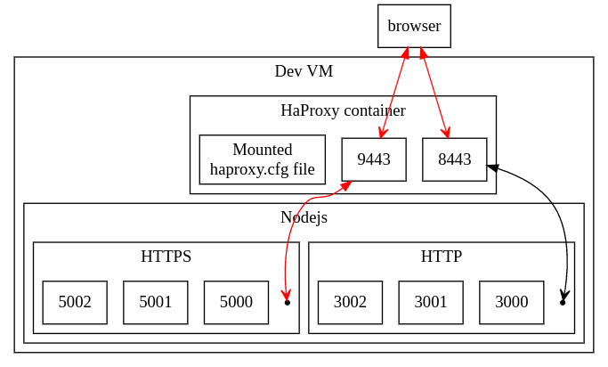
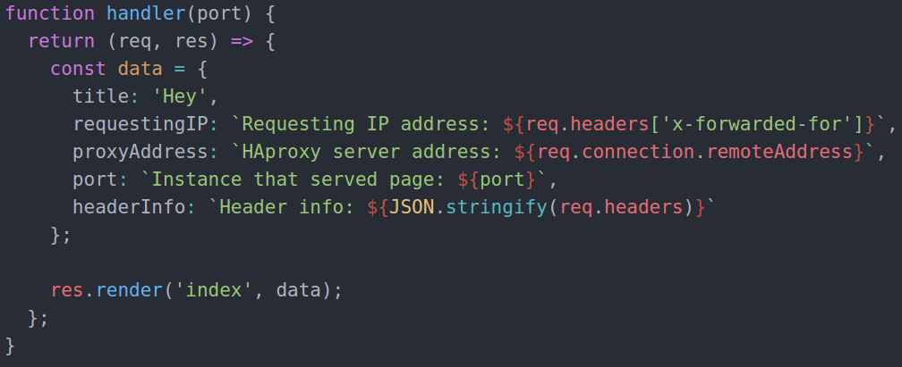

#### Name: Thai Kha le
#### Student ID: 20061112

## HAProxy lab report

Project can be found at https://github.com/thailekha/haproxy-termination-passthough

To demonstrate SSL termination and passthrough, I built the following architecture:

### Design
- A Vagrant script sets up the Dev VM having:
  - A shared folder containing the haproxy.cfg (this allows using fancy editors from host, hence faster scripting)
  - Its 8443 and 9443 ports respectively mapped to the host's 8443 and 9443 ports
- The whole shared folder containing the haproxy.cfg is mounted into a HAProxy container, which is launched directly into the `host` network
- Nodejs script sets up 3 HTTP instances listening on ports 3000,3001,3002 (`HTTP` group); and 3 HTTPS instances listening on ports 5000,5001,5002 (`HTTPS` group)
- To display required information, I use express and pug template engine
- HAproxy config:
  - SSL termination: frontend listening on port 8443 connected to the `HTTP` backend
  - SSL passthrough: frontend listening on port 9443 connected to the `HTTPS` backend

### Traffic Flow
(Red lines stands for HTTPS traffic, black line stands for HTTP traffic)
- SSL termination: browser makes HTTPS request to port 8443, SSL is terminated at HAProxy and HTTP traffic is forwarded to the  HTTP group in round robin. When either of the instance response to HAProxy, HAProxy adds SSL to the response and forwards back to the browser
- SSL passthrough: browser makes HTTPS request to port 9443, HAProxy just forwards the traffic to the  HTTPS group in round robin. When either of the instance response to HAProxy, HAProxy forwards the response to the browser

### Nodejs snippet displaying information

When any of the Nodejs instance gets the request, it returns the requesting IP address from the `x-forwarded-for` header; HAproxy server address from the `remoteAddress` of the connection; the Nodejs instance that served page (the port number will be the indicator in this case); and HTTP/HTTPS Header information

### Demo - SSL termination

Send HTTPS requests to port 8443:

In this scenario:
- HAProxy removes SSL and insert the `x-forwarded-for` header containing the requesting IP address (my host machine in this case - `10.0.2.2`).
- HAproxy server address is `127.0.0.1`
- Node instance that serves that page: in this case are instances that listen on ports 3000,3001,3002

### Demo - SSL passthrough

Send HTTPS requests to port 9443:

In this scenario:
- HAProxy does not insert the `x-forwarded-for` header so the Nodejs instances cannot get the requesting IP address, resulting in `undefined`
- HAproxy server address is `127.0.0.1`
- Node instance that serves that page: in this case are instances that listen on ports 5000,5001,5002

### SSL Termination vs SSL Passthrough
One of the key points of this lab is whether or not the backend will get the requesting IP address. So to choose between SSL termination and SSL passthrough, one may need to know whether the backend will need to store anything from the requesting IP address (stateless or stateful). If the backend will not need the requesting IP then SSL passthrough can be a good choice because HAProxy will not have to decapsulate all the way up to layer 7 and encapsulate all the way down, it will just need to inspect up to layer 4.

### To run this project
- Install Vagrant 1.8.6
- Install Virtualbox 5.1.6
- Clone this project and run `vagrant up`
- Open 2 terminals and run `vagrant ssh` in each to login to the VM
- In terminal 1: `cd /mnt/vagrant && node server.js`
- In terminal 2: `cd /mnt/vagrant && sudo ./run-haproxy.sh`
